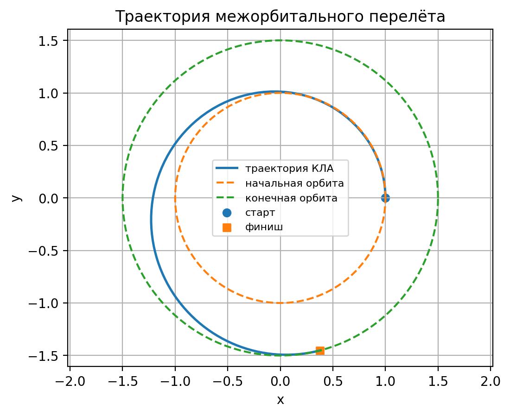

# Orbital Transfer Numerical Model

Численная модель управляемого перелёта космического аппарата между двумя круговыми орбитами. Проект показывает работу с системой дифференциальных уравнений, оптимизацией параметров управления и сравнением численных методов.



## Постановка задачи

В безразмерной модели требуется перевести аппарат с орбиты радиуса `r₀ = 1.0` на орбиту `rₖ = 1.5`. Направление постоянной тяги задаётся кубическим полиномом:

```text
α(t) = a₀ + a₁τ + a₂τ² + a₃τ³,  τ = t / tₖ
```

Пять параметров управления (`a₀…a₃`, `tₖ`) уточняются методом пристрелки через `fminsearch`. После оптимизации траектория рассчитывается тремя способами:

- `ode45` — адаптивный метод Рунге–Кутты 4–5 порядка;
- собственная реализация метода Рунге–Кутты 4 порядка;
- собственная реализация метода Эйлера.

## Результат

| Метод | Конечная скорость V | Конечный радиус r | Ошибка радиуса |
|---|---:|---:|---:|
| Цель | 0.8164965809 | 1.5000000000 | 0 |
| ode45 | 0.8164968471 | 1.4999982158 | −0.0000017842 |
| Рунге–Кутта 4 | 0.8164968470 | 1.4999982160 | −0.0000017840 |
| Эйлер | 0.8129414728 | 1.5071984574 | +0.0071984574 |

`ode45` и собственный RK4 дают практически одинаковый конечный результат; метод Эйлера при том же количестве шагов заметно менее точен. Полное сравнение находится в `kursovaya_task7_terminal_comparison.csv`.

## Что создаёт расчёт

- подробный временной ряд состояния и управления;
- таблицу значений для отчёта;
- сравнение терминального состояния трёх методов;
- шесть графиков: траектория, радиус, скорость, угол, закон управления и масса.

## Запуск

Требуется MATLAB с поддержкой `ode45` и `fminsearch`.

```matlab
kursovaya_task7
```

Скрипт сам решает задачу оптимизации, выполняет три расчёта, печатает итоговые значения и обновляет CSV-файлы и графики.

## Структура

- `kursovaya_task7.m` — модель, оптимизация и численные методы;
- `kursovaya_task7_results.csv` — подробная траектория;
- `kursovaya_task7_table_for_report.csv` — компактная выборка;
- `kursovaya_task7_terminal_comparison.csv` — сравнение методов;
- `assets/` — итоговые визуализации.

Проект выполнен как учебная курсовая работа по дифференциальным уравнениям; персональные данные и исходный отчёт не публикуются.
